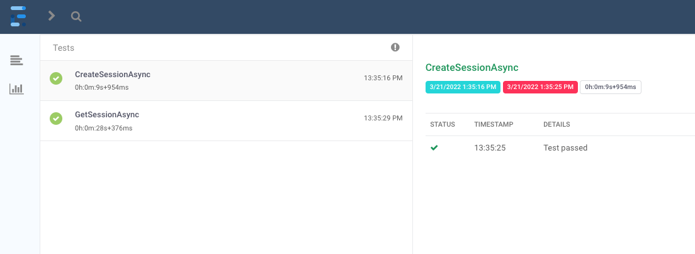
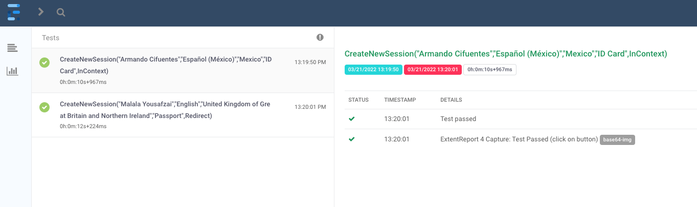
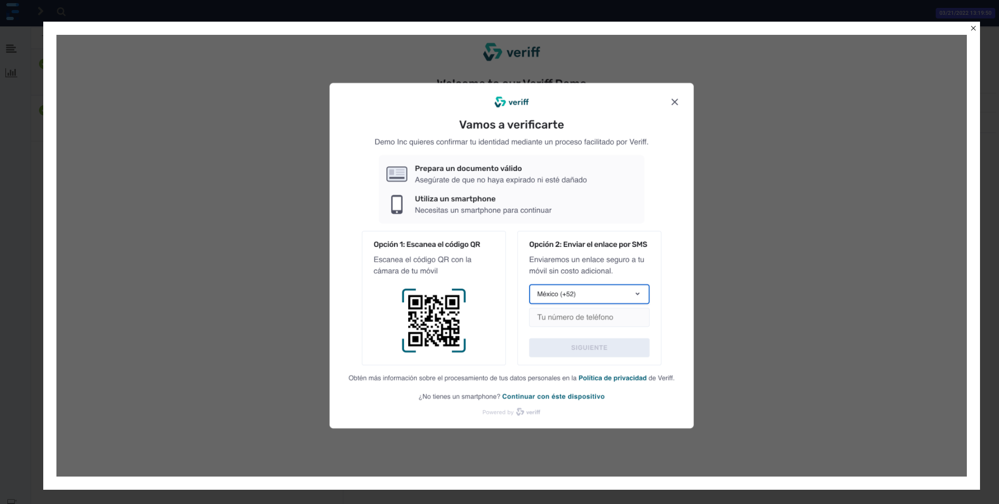

# Veriff Demo assessment

A technical assessment for the **Software Engineer in Test** position.

## The project 💻

The following project was made using *C#*, *NUnit*, *RestSharp*, *Selenium* and *Extent Reports*. Review [here](/QE_test-task.pdf) the assessment proposed.
Review the test plan [here](/TestPlan.md)

## Tools ⚙️

* *Visual Studio Code for Mac (v8.10.20 (build 0))*.
* *C# (.NET Core 3.1)*.
* *NUnit v3.12.0*.
* *NUnit3TestAdapter v3.16.1*.
* *RestSharp v107.3.0*.
* *Selenium.Support v4.1.0*.
* *Selenium.WebDriver v4.1.0*.
* *Selenium.WebDriver.ChromeDriver v99.0.4844.5100*.
* *DotNetSeleniumExtras.WaitHelpers v3.11.0*.
* *ExtentReports v4.1.0*.
* *ExtentReports.Core v1.0.3*.
* *Postman v9.14.13* (for manual testing of the endpoints).

## Project structure 🗂️

```xml
|---- VeriffDemo
    |---- API
        |---- Client
        |---- Data
        |---- Models
            |---- Payloads
            |---- Responses
    |---- Tests
        |---- API
        |---- UI
            |---- AutomationResources
        |---- Utilities
    |---- UI
        |---- PageObjectModel
            |---- Components
                |---- Home
                |---- Redirect
            |---- Pages
            |---- Utilities
```

## Setup 🛠️

I developed the code using a Mac, but it should work on a PC.

> .NET Core 3.1, or higher, is needed to run the project.

The following steps can be executed using a terminal (I use [hyper](https://hyper.is/)).

1. Clone the repo.-

```shell
git clone https://github.com/ArCiGo/VeriffDemo.git
```

2. Install the packages
```shell
dotnet build
```

## Run the tests

```shell
# Run all tests
dotnet test
```

```shell
# Running the tests by category

# API tests
dotnet test --filter TestCategory=API

# UI tests
dotnet test --filter TestCategory=UI
```

When you execute the tests, new folders are generated at the workspace root (APIReports and UIReports). 
Inside of these folders, you are going to see the index.html reports (you can open them using your favorite browser).






